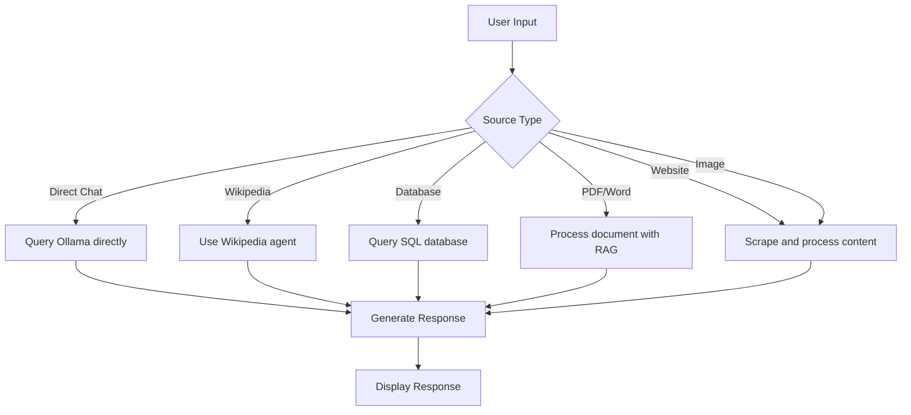

# Ollama AI Chat Application

A full-featured chat application that allows you to interact with various AI models through Ollama, supporting multiple data sources including documents, websites, databases, and more.

## Features

- 💬 Chat with various Ollama models (llama3, gemma, phi3, qwen)
- 📚 Multiple source types: Direct Chat, Wikipedia, Database, PDF, Word, Website
- 🖼️ Multimodal support (image processing)
- 🧠 Conversation memory and context retention
- 📊 Database querying capabilities
- 📄 Document processing (PDF, Word)
- 📚 Images processing
- 🌐 Website content extraction
- 🔍 Wikipedia integration
- 🎨 Modern, responsive UI

## Screenshots

### Main Chat Interface


## Tech Stack

- **Frontend**: HTML5, CSS3, JavaScript, Bootstrap 5
- **Backend**: Python, Flask
- **AI Models**: Ollama (llama3.2, gemma3, phi3, qwen)
- **Document Processing**: PyPDF2, python-docx
- **Web Scraping**: BeautifulSoup
- **Vector Storage**: FAISS
- **LangChain Integration**: For RAG and agent workflows

## Prerequisites

Before you begin, ensure you have met the following requirements:

- Python 3.8 or higher
- Ollama installed and running locally ([installation instructions](http://localhost:11434/v1)
- Required Python packages (listed in requirements.txt)

## Installation

### 1. Clone the repository

```bash
git clone https://github.com/ritigit7/Chat-with-all.git
cd Chat-with-all
```

### 2. Set up Python environment

```bash
python -m venv venv
source venv/bin/activate  # On Windows use `venv\Scripts\activate`
```

### 3. Install Python dependencies

```bash
pip install -r requirements.txt
```

### 4. Download Ollama models

You'll need to download the models you want to use. For example:

```bash
ollama pull llama3.2
ollama pull gemma3
ollama pull phi3
ollama pull qwen
```

### 5. Configure the application

Create a `.env` file in the root directory with your configuration:

```ini
FLASK_ENV=development
FLASK_APP=app.py
OLLAMA_API_BASE=http://localhost:11434
```

## Usage

### Running the Application

1. Start the Ollama server (if not already running):

```bash
ollama serve
```

2. In a separate terminal, start the Flask application:

```bash
flask run
```

3. Open your browser and navigate to:

```
http://localhost:5000
```

### Using the Application

1. **Select a Model**: Choose from the available Ollama models in the sidebar, If you want to use Image Chat part then use gemma3 because this is multimodel.
2. **Choose a Source Type**: Select what you want to chat with (direct chat, documents, websites, etc.).
3. **Configure the Source**: Follow the setup instructions for your selected source type.
4. **Start Chatting**: Type your message in the input box and press Enter or click Send.

## Workflow



## API Endpoints

The backend provides the following API endpoints:

- `POST /api/init_session` - Initialize a new chat session
- `GET /api/models` - Get available models
- `POST /api/set_model` - Set the current model
- `POST /api/set_source` - Set the current source type
- `POST /api/init_wikipedia` - Initialize Wikipedia agent
- `POST /api/init_database` - Initialize database connection
- `POST /api/process_pdf` - Process PDF document
- `POST /api/process_docx` - Process Word document
- `POST /api/process_website` - Process website content
- `POST /api/process_image` - Process image with text prompt
- `POST /api/chat` - Send chat message
- `POST /api/history` - Get chat history
- `POST /api/clear_chat` - Clear chat history

## Configuration

You can configure the application by modifying the following:

1. **Models**: Edit the `get_ollama_llm()` function in `app.py` to change default models.
2. **File Paths**: Update the directory paths at the top of `app.py` to match your system.
3. **UI**: Modify the HTML/CSS in `templates/index.html` for visual changes.

## Troubleshooting

### Common Issues

1. **Ollama connection errors**:
   - Ensure Ollama is running (`ollama serve`)
   - Check that the API base URL is correct (default: `http://localhost:11434`)

2. **Model not found**:
   - Verify you've pulled the model (`ollama pull modelname`)
   - Check the model name is correct

3. **Document processing failures**:
   - Ensure the file is not corrupted
   - Check file permissions

### Logs

The application generates logs in `/logs/chat_app.log`. Check this file for detailed error information.

## Contributing

Contributions are welcome! Please follow these steps:

1. Fork the repository
2. Create a new branch (`git checkout -b feature/your-feature`)
3. Commit your changes (`git commit -am 'Add some feature'`)
4. Push to the branch (`git push origin feature/your-feature`)
5. Open a Pull Request

## License

This project is licensed under the MIT License - see the [LICENSE](LICENSE) file for details.

## Acknowledgments

- [Ollama](https://ollama.ai/) for providing the AI models
- [LangChain](https://www.langchain.com/) for the AI orchestration framework
- [Flask](https://flask.palletsprojects.com/) for the web framework
- [Bootstrap](https://getbootstrap.com/) for the UI components

## Contact

For questions or support, please contact:

Your Name - your.email@example.com  
Project Link: [https://github.com/ritigit7/Chat-with-all](https://github.com/ritigit7/Chat-with-all)
